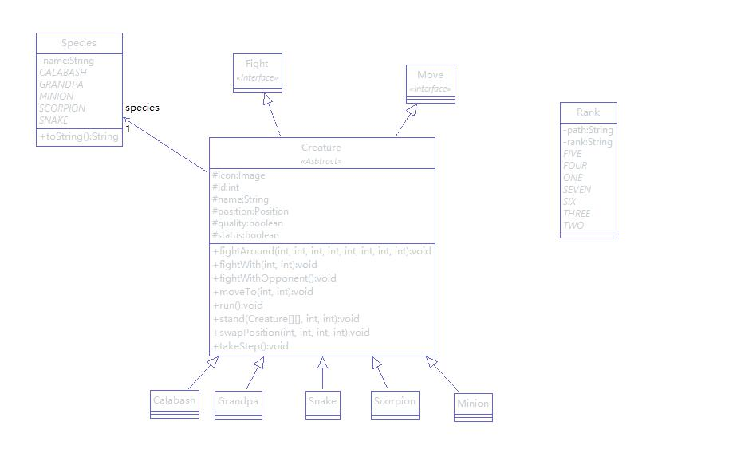

#CalabashGame
- 学号：161220116 
- 姓名：汤思怡 
- 联系方式：125256623@qq.com

##开发环境
- Eclipse Photon
- Java 10.0.2 2018-07-17
- Apache Maven 3.6.0

##项目简介
- 支持在游戏开始或结束后对邪恶势力的阵型排序
- 支持在游戏未开始或已结束后回放

##运行说明
- 使用Maven对项目打包
- 运行target目录下的CalabashGame.jar
- 在游戏开始前选择阵型（按键1：鹤翼；按键2：雁行；按键3：冲轭；按键4：鱼鳞；按键5：方円；按键6：偃月）
- 按下空格键游戏开始
- 在游戏结束或开始前可以使用按键L选择回放的记录

##运行截图
- 鹤翼阵型
<br></br>
- 偃月阵型
<br></br>
- 正在战斗
<br></br>
- 记录读取
<br></br>

##项目目录
###javaScreenshot
- README.md中使用到的图片

###CalabashGame
- src：项目源码
- image：项目中需要加载的图片资源
- Logs：战斗记录


##代码结构
###ui模块
- 该模块中只有一个类：Main，Main.main() 是程序入口
- 利用javafx提供了图形界面
- 根据键盘输入的指令做出相应处理


###Constants模块
####说明
- 定义了项目中所需要的常量

###creature模块
####说明
- 定义了生物抽象基类Creature
- 利用接口Fight和Move限定了了生物行为
```
/* 战斗接口 */
public interface Fight {
    void fightWith(int x, int y);

    void fightAround(int x0, int x1, int x2, int x3, int x4, int x5, int x6, int x7);

    void fightWithOpponent();
}
```
```
/* 移动接口 */
public interface Move {
    void swapPosition(int x0, int y0, int x1, int y1);

    void moveTo(int x, int y);

    void takeStep();
}

```

- 从基类派生了葫芦娃Calabash、老爷爷Grandpa、蛇精Snake、蝎子精Scorpion、喽啰Minion类
#####行为说明
######移动行为
- 生物观察四周并选取一个没有被占有的地点成为其移动目标
- 在一个生物移动时，利用synchronized关键字给战场资源上锁，避免两个生物同时站在同一块位置的情况发生
######战斗行为
- 生物观察四周，如果周围有敌人，评估双方实力选择战斗与否
- 如果失败，以墓碑形式固定在原地不动；如果成功，则继续下一步
- 在一个生物与另一个生物战斗时，将战斗对象用synchronized上锁，以在同一时间一个对象被杀两次
####UML
<br></br>


###formation模块
####说明
- 定义了阵型抽象基类Form
- 利用枚举类型Formation列出允许的六种阵型
```
public enum Formation {
    /* 变换队形：鹤翼、雁行、冲轭、长蛇、鱼鳞、方円、偃月、锋失 */
    CRANE("鹤翼"), GOOSE("雁行"), YOKE("冲轭"), SNAKE("长蛇"), FISH("鱼鳞"), SQUARE("方円"), MOON("偃月"), FRONT("锋失");
    private String name;

    private Formation(String name) {
        // TODO Auto-generated constructor stub
        this.name = name;
    }

    public String toString() {
        return name;
    }
}
```
- 从抽象基类派生出鹤翼CraneForm、雁行GooseForm、冲轭YokeForm、长蛇SnakeForm、鱼鳞FishForm、方円SquareForm、偃月MoonForm、锋失FrontForm
####UML
<br></br>


###ground模块
####说明
- 定义了战场类Ground类，是在整个文件中只有一个实例
- 定义了Position类，记录了生物在战场上所处的位置


###log模块
####说明
- 定义了记录抽象基类Log
- 从Log类派生出移动记录MoveLog、战斗记录FightLog
- 定义了读取、存储记录文件的LogFile类
####UML
<br></br>


###sides模块
####说明
- 定义了阵营类：邪恶阵营EvilSide、善良阵营GoodSide
- 利用接口Formate给出了阵营中生物可做的动作：按阵型排序
```
/* 阵型排列接口 */
public interface Formate {
    public void formate(Creature dimension[][], Form form);
}

```
- 利用比较器对葫芦娃按颜色排序
```
public void sortCalabash() {
        Comparator<Calabash> comparator = new Comparator<Calabash>() {
            public int compare(Calabash a, Calabash b) {
                if (a.getRank() > b.getRank())
                    return 1;
                else if (a.getRank() < b.getRank())
                    return -1;
                else
                    return 0;
            }
        };
        Collections.sort(calabashBrothers, comparator);
    }
```
####UML
<br></br>


###test模块
####GoodSideTest.java
- 对善良阵营中利用比较器给葫芦娃排序的功能进行了测试

####CalabashTest.java
- 对葫芦娃的构造函数及获取的枚举类型是否正确进行了测试


##设计原则
###单一职责原则(SRP)
- 使Creature类同时依赖两个接口Fight、Move，分离了战斗和移动职责 

###里氏替换原则(LSP)
- 在所有用到基类（Creature、Log、Form）的地方都用其子类替换后仍能正确工作，因为代码中对于方法的调用依靠动态绑定实现的而不是利用判断对象类型。

####接口分隔原则(ISP) 
- 在规定生物的行动时利用两个接口：Fight、Move，将移动和战斗行为分离，避免了一个接口拥有移动和战斗两类方法，导致接口臃肿的问题。

###依赖倒置原则(DIP)
- 代码中细节实现（例如战斗、阵营排列、移动）是依赖抽象类 / 接口的。
- 模块间的依赖通过抽象发生，实现类之间不存在直接的依赖关系。

###合成/聚合复用原则(CARP)
- 在善良阵营GoodSide和邪恶阵营EvilSide中由通过聚合相应的生物对象构成

##实验感想
- 非常感谢曹春老师、余萍老师对java理论的细致讲解，也非常感谢老师、助教这一个学期以来耐心的解答我的蠢问题。
- 虽然写葫芦娃的过程非常痛苦（...），但是我确实在这个痛苦的过程当中收获良多：我对面向对象编程有了更加深入的理解，也对怎样才算是一份合格的面向对象的代码有了标准。
- 虽然这次的代码抽象的可能不是特别好，但是希望在以后的编程中我能越来越熟练的将理论标准运用到我的代码中取。
